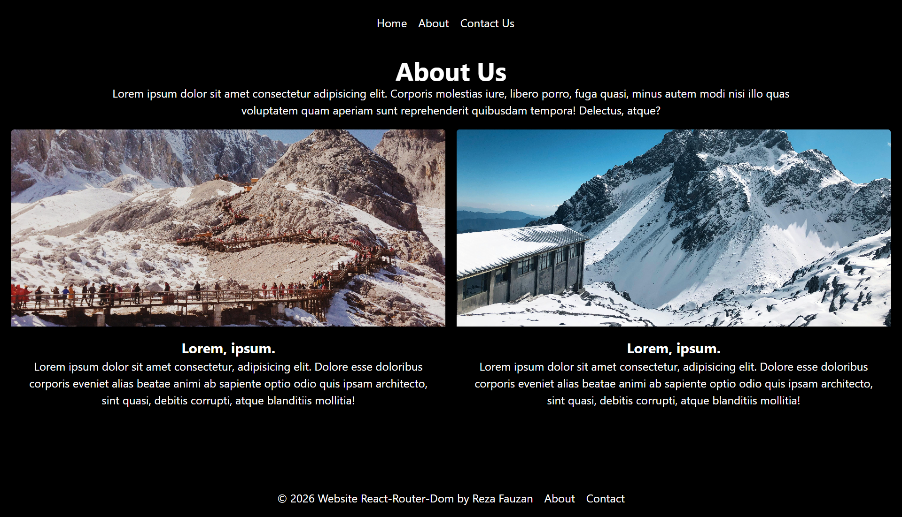
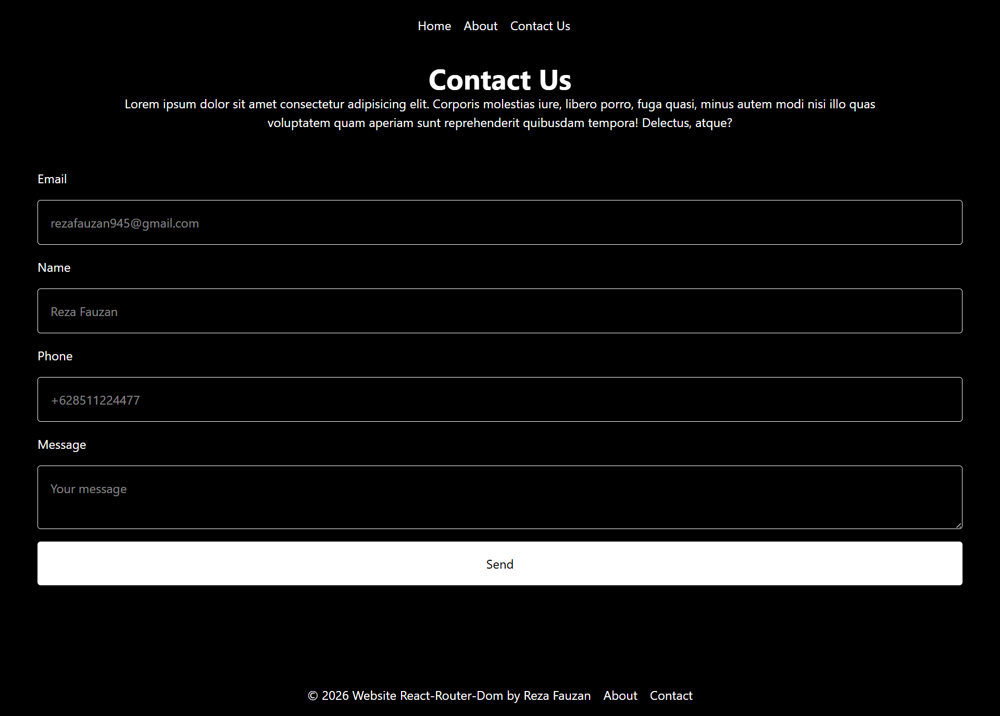

# React App with react-router-dom
Slicing a website from a refference image

## Refference

## Sliced Home Page Screenshoot

## About Page Screenshoot

## Contact Page Screenshoot

## How To Run It
- Download source code
- npm install
- npm run dev
- open https://localhost:5173